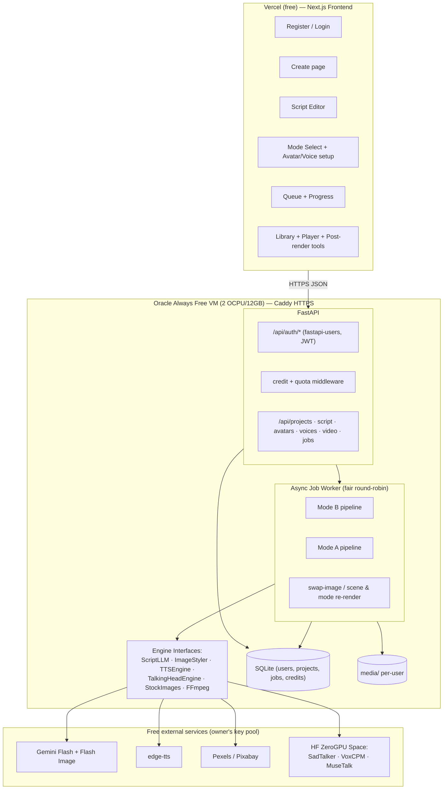

# High-Level Architecture

## Layers

- **Frontend (Vercel)**: seven views ([`10-frontend-pages.md`](./10-frontend-pages.md)) incl. auth pages. Talks JSON to the VM; polls job status.
- **FastAPI on the VM**: auth (`fastapi-users`, JWT cookies), then a **credit/quota middleware** every mutating route passes through, then thin CRUD/job routes. Script generate/improve are synchronous; all media work is a job.
- **Job worker**: single-process async worker with **per-user round-robin fairness** and queue-position reporting ([`07-job-queue-and-progress.md`](./07-job-queue-and-progress.md)). CPU jobs run on the VM; GPU stages call the ZeroGPU Space via `gradio_client` under a daily GPU-seconds budget.
- **Engine interfaces**: every external/free dependency sits behind a small typed interface so fallbacks swap without pipeline changes.
- **Storage**: SQLite (users, projects, versions, jobs, credits, usage) + per-user media folders; retention policy prunes old renders ([`02-research/08-free-hosting.md`](../02-research/08-free-hosting.md)).

Source diagram: [`05-flowcharts/01-high-level-architecture.mmd`](../05-flowcharts/01-high-level-architecture.mmd).
