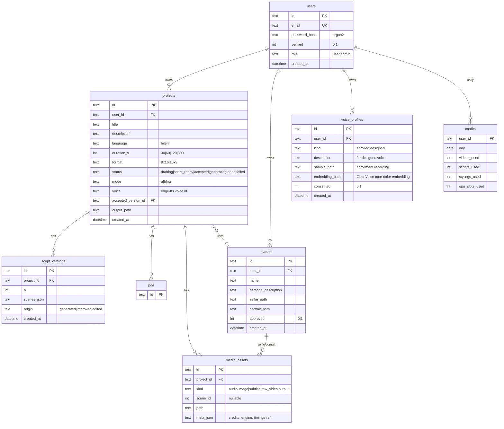

# Data Model (SQLite)

(`jobs` columns detailed in [`07-job-queue-and-progress.md`](./07-job-queue-and-progress.md).)

## Notes

- **Every user-owned table carries `user_id`; every query filters on it.** Account deletion cascades rows + media folders (`media/users/<uid>/…`).
- `credits` rows are upserted per `(user_id, day)` and decremented atomically with job creation; limits themselves live in config, not the DB ([`01-requirements/10-hosting-accounts-quotas.md`](../01-requirements/10-hosting-accounts-quotas.md)).
- `voice_profiles.consented` gates cloned voices the same way avatar consent gates selfies.
- `scenes_json` = the validated script contract array (`[{id, text, visual_hint, visual_hint_stale}]`). Scenes are a JSON column, not a table — they're always read/written as a unit with their version.
- `avatars` is project-independent by design: approve once, reuse forever (requirement in [`04-mode-a-avatar.md`](../01-requirements/04-mode-a-avatar.md)).
- Filesystem layout mirrors the DB: `media/users/<uid>/projects/<id>/{audio/,images/,subs/,output.mp4,credits.txt}` and `media/users/<uid>/avatars/<id>/{selfie,portrait}.png`. DB stores paths; files are the payload. Deleting a project deletes its folder; a retention job prunes rendered MP4s after N days (config; scripts/projects stay re-renderable).
- IDs: UUIDv7 strings (sortable).
- Migrations: plain numbered SQL files applied at startup (no Alembic ceremony for SQLite).
- Word-timing arrays are stored as JSON files next to the audio they describe (`audio/scene-3.timings.json`), referenced from `media_assets.meta_json` — too bulky and too single-purpose for DB rows.
